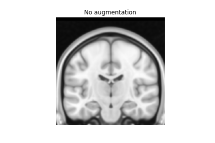
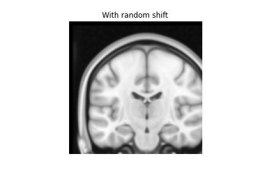
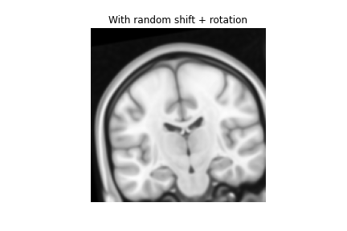
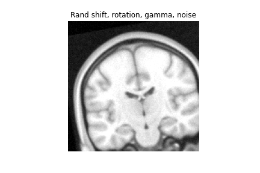

# Nifti transforms of 3D MRI images for pytorch

Code with examples that can be used for data loading and data augmentation of 3D MRI images.

Cropping, scaling and rotation are computed as individual transformation matrices that are mutliplied before being applied (all at once) to the image data in ApplyAffine(). This way the interpolation, which is the major bottleneck, is done only once.

`example.py` contains examples of how to use the transformations in `transforms.py`.

<em>Figure: Examples of augmentations. </em>
## License

Code is licensed under the MIT License - see [LICENSE.md](LICENSE.md) for details.

Please note that code relies on third-party libraries, s.a. nibabel [license](http://nipy.org/nibabel/legal.html) and scipy.

## Contact
gustav.martensson@ki.se
